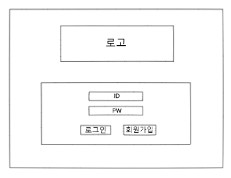
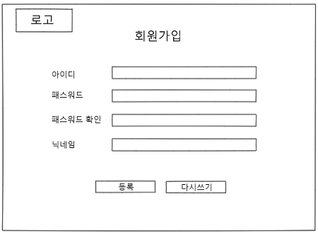
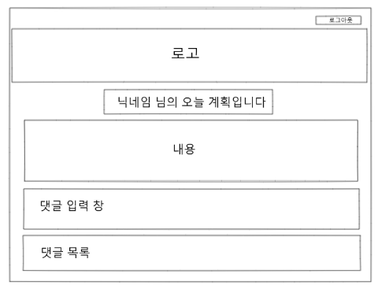

# 미니 프로젝트

## 프로젝트 명

오늘 뭐하지?

## 소개

매일 오늘 할 일을 정해서 적고 각 참여자가 밑에 응원 댓글을 달 수 있는 웹사이트

## 페이지 구성

[필요 API](https://www.notion.so/7ae7f153e6d64851a950db93ceee5167)

- 로그인 페이지 - 강성종, 고동현, 정재호
    
    
    
    - 로그인 기능
    → 유저가 아이디, 패스워드를 입력한 후 ‘로그인’버튼을 클릭하면 정보 확인 후 로그인 처리(메인 페이지로 이동)
    - 회원가입 페이지 렌더링
    → ‘회원가입’ 버튼 클릭 시 회원가입 페이지로 렌더링
    - 페이지 새로고침
    → 페이지 중앙 로고 클릭 시, 로그인 페이지로 렌더링(같은 페이지에서 재이동)
    - 유효성 검사
    → 유저 아이디, 패스워드 유효성 검사
- 회원가입 페이지 - 정재호
    
    
    
    - 회원가입(등록) 기능
     → 유저가 입력한 아이디, 패스워드, 닉네임이 입력 요구사항을 충족할 시, user DB에 데이터 등록
    - 다시쓰기 기능
     → 유저가 입력 도중 ‘다시쓰기’ 버튼을 클릭하면 입력했던 내용을 빈 칸으로 변환
    - 로그인 페이지 이동
     → 좌측 상단 로고를 클릭하면 로그인 페이지로 이동
    - 유효성 검사
     → 입력 정보 유효성 검사
- 포스팅 페이지
    
    
    
    - 데일리 플랜 등록하기, Plan DB에 데이터 등록
- 메인 페이지
    
    
    
    - 로그아웃
    - 작성된 포스트 세부내용 페이지로 이동
    - 포스팅 페이지로 이동
- 세부내용 페이지
    
    
    
    - 로그아웃
    - 해당 닉네임이 작성한 오늘의 계획 출력
        - 닉네임
        - 내용
    - 해당 포스팅에 해당되는 댓글 목록 출력
        
        → planDB 상 comment(0~?) 불러오기
        
        - 작성자 닉네임
        - 해당하는 댓글 내용
    - 댓글 작성
        
        → planDB 상 nickname, comment 값에 추가
        
        - 작성자 닉네임
        - 내용

날짜 별 포스팅 검색 가능(추가 목표)

수정, 삭제(추가 목표)

닉네임, 패스워드 변경(추가 목표)

## Github

[https://github.com/devgusehdrh/TodayMyPlan.git](https://github.com/devgusehdrh/TodayMyPlan.git)

## 프로젝트 1일차 진행상황

- 로그인 구현

## 질문

AWS

Mongo DB